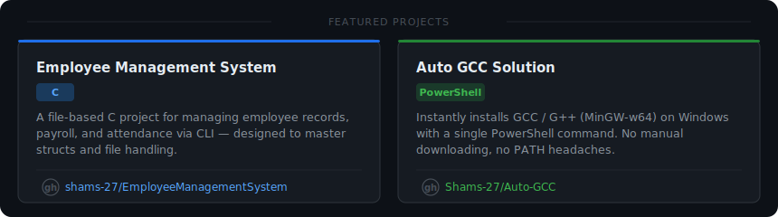

<!--Profile Metrics-->

<table>
  <tr>
    <td>
      
    </td>
    <td>
      
    </td>
  </tr>
</table>

<table>
<tr>
<td width="50%">
  

 

$\Large\textbf{Employee Management System}$

 

**Tech Stack:** C

A file-based C project for managing employee records, payroll, and attendance via CLI—designed to master structs and file handling.

</td>

<td width="50%">

 

$\Large\textbf{Auto GCC Solution}$

 

**Tech Stack:** Powershell

Instantly installs GCC / G++ (MinGW-w64) on Windows with a single PowerShell command. No manual downloading, no PATH headaches.

</td>
</tr>
</table>

